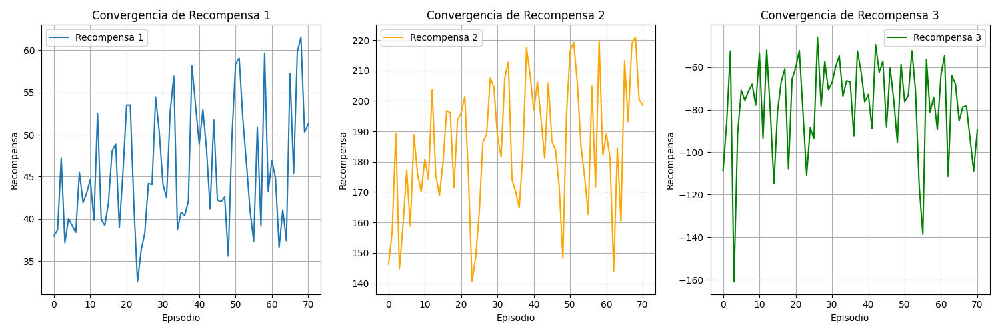
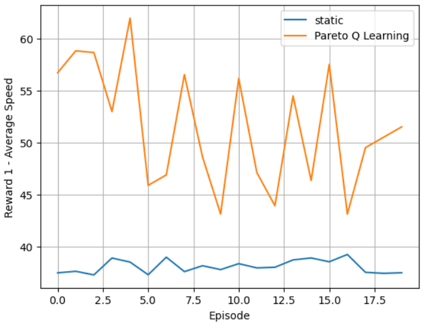
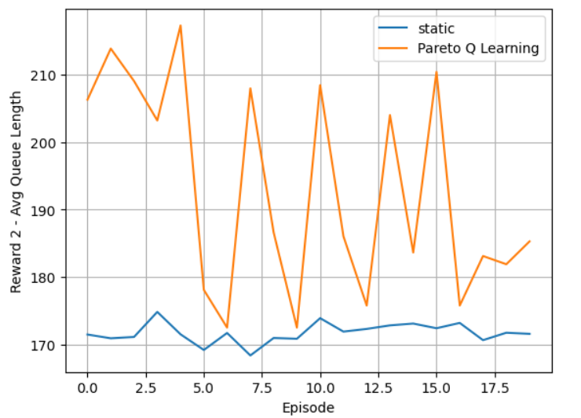
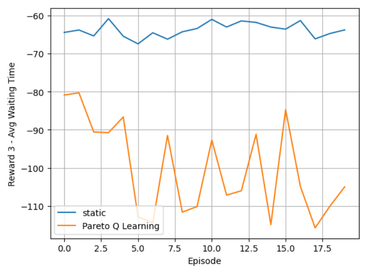

# Reinforcement Learning for Traffic Lights on Route to UNAM

This project proposes an intelligent traffic light control system based on **Multi-Objective Reinforcement Learning** (MORL) using **Pareto Q-Learning** to optimize traffic flow at a critical intersection near UNAM: **Avenida Copilco and Cerro del Agua**.

Implemented in the **SUMO** traffic simulator, the agent optimizes three objectives:

- Waiting Time  
- Queue Length  
- Traffic Flow (Average Speed)

---

## Motivation

Mexico City suffers from chronic traffic congestion, particularly near university campuses like UNAM. The intersection at Copilco and Cerro del Agua is a high-impact bottleneck that affects thousands of students and workers daily.

Traditional fixed-time systems can't adapt to real-time traffic patterns. Reinforcement Learning, especially in its **multi-objective** form, offers a flexible solution to optimize multiple conflicting goals simultaneously.

---

## Approach: Pareto Q-Learning

We extend classical Q-Learning to support multiple objectives by storing **reward vectors** for each action. The algorithm updates a Pareto front of optimal policies and selects among them to maintain diversity.

### Reward Function

Each reward vector consists of:

| Metric           | Description |
|------------------|-------------|
| `average_speed`  | Avg. vehicle speed relative to their max speed |
| `queue_length`   | Fewer vehicles in queue = higher reward |
| `waiting_time`   | Less waiting = higher reward (inverted) |

r_t = [average_speed, queue_length, waiting_time]

---

## Methodology

### Simulation

- **Simulator**: [SUMO](https://www.eclipse.org/sumo/)
- **Intersection modeled**: Copilco - Cerro del Agua, Mexico City
- Features:
  - Dynamic vehicle flow
  - Multiple lanes and light phases
  - 4 traffic light actions/phases

### State Representation

Agent observes:
- Current traffic light phase
- Discretized traffic density
- Average queue sizes

### Actions

The agent chooses among 4 traffic light configurations:

| Action | Description |
|--------|-------------|
| 0 | Enable Copilco East-West |
| 1 | Enable Copilco West-East |
| 2 | Enable Cerro del Agua (both directions) |
| 3 | Enable Cerro del Agua toward Copilco |

*See `images/` folder for visual representations.*

---

## ⚙️ Training Setup

- α (learning rate): `0.1`  
- γ (discount): `0.99`  
- ε-greedy policy: `ε=1.0 → 0.01`  
- Episodes: `70`  
- Episode duration: `900s` simulated time

---

## Results

### Convergence

The agent shows stable convergence over time, improving total reward values.

### Real vs Simulated Comparison

| Metric           | Static Control | RL (Pareto Q-Learning) |
|------------------|----------------|-------------------------|
| Avg Speed        | 38.07          | **51.50**               |
| Queue Length     | 171.7          | **193.08**              |
| Waiting Time     | -63.79         | **-100.1**              |

> While waiting time slightly increased, overall throughput and queue reductions make the RL-controlled system more efficient in real conditions.

---

## Conclusion

- **Pareto Q-Learning** successfully balances multiple objectives in traffic optimization.
- The agent outperforms traditional static light control, especially in **speed** and **flow efficiency**.
- Shows real-world applicability for **adaptive urban mobility systems**.

---

## References

- Liu et al. (2023). *Deep Reinforcement Learning for Traffic Signal Control*.
- Kolat et al. (2023). *Multi-objective Reinforcement Learning: A Survey*.
- Van Moffaert & Nowé (2014). *Multi-objective Reinforcement Learning using Sets of Pareto Dominated Solutions*.
- Alegre et al. (2019). *SUMORL: A SUMO Reinforcement Learning Interface*.

---

## Author

**Daniel Rodríguez**  
UNAM
